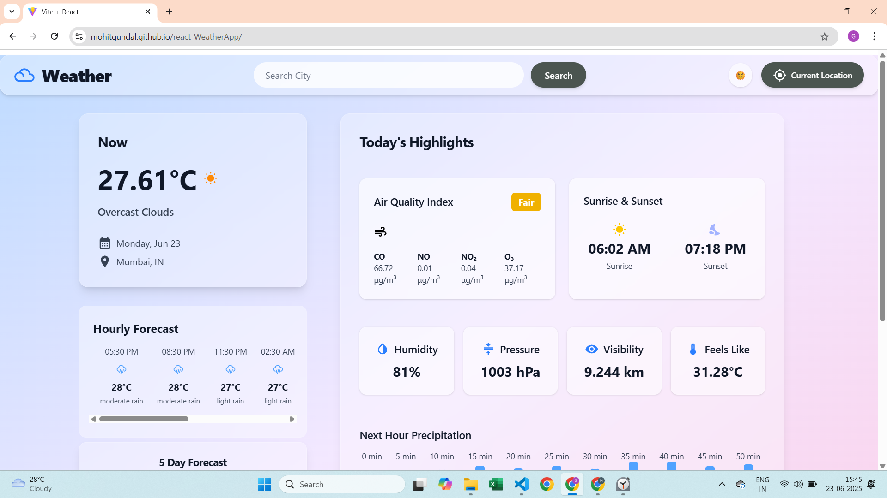
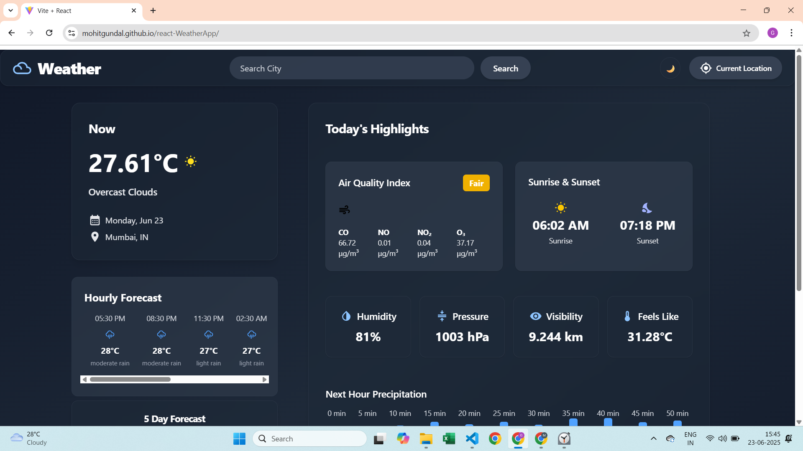

# React Weather App

A modern, responsive weather application built with React, Vite, Tailwind CSS, and Material UI that provides accurate current weather, air quality, and forecast data for any city worldwide.

---

# Overview
This React Weather App allows users to search for any city and get detailed weather information including temperature, humidity, wind speed, air quality index (AQI), sunrise and sunset times, and minute-by-minute precipitation visualization. It uses the OpenWeatherMap API to fetch real-time data and presents it with a clean, user-friendly interface.

# Features

- **Current Weather Data:** Real-time temperature, humidity, wind speed, pressure, and feels-like temperature.
- **Air Quality Index:** Displays AQI with pollutant details (CO, NO, NO₂, O₃).
- **Sunrise & Sunset:** Shows local sunrise and sunset times.
- **Minute-by-Minute Precipitation:** Visualizes upcoming precipitation chances.
- **Responsive Design:** Works well on desktop and mobile with light/dark mode support.
- **Search Functionality:** Search weather by city name worldwide.
- **Material UI & Tailwind CSS:** Combines Material UI icons with Tailwind CSS for styling.
- **Built with Vite:** Fast development and optimized build process.

---

## Screenshots

## Dark Theme Mode


## Light Theme Mode


---

## Technologies Used

- **HTML5** — Structure and markup
- **CSS3** — Styling, including CSS variables for theme support and responsiveness
- **JavaScript (ES6)** — Logic for calculator operations, theme toggling, and history management

---

## Installation and Usage

1. **Clone the repository:**
   
```bash
git clone https://github.com/mohitgundal/react-WeatherApp.git
```


2. **Navigate to the project folder:**

```bash
cd Calculator-App
```

3. **Install dependencies:**

```bash
npm install
```

4. **Create a .env file in the root and add your OpenWeatherMap API key:**

```bash
VITE_WEATHER_API_KEY=your_api_key_here
```

5. **Running Locally**
**Start the development server:**

```bash
npm run dev
```

Open http://localhost:5173 in your browser.
